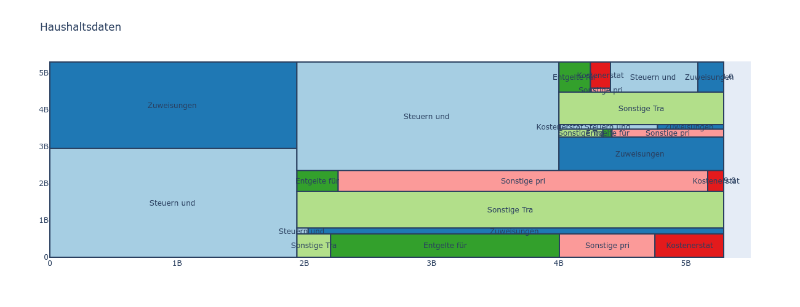
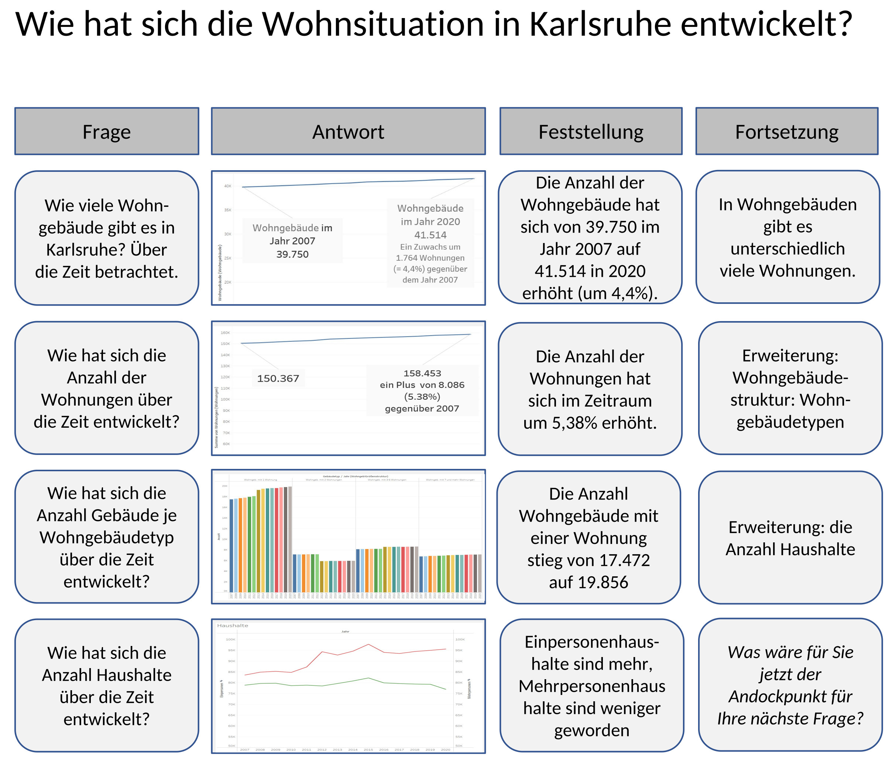
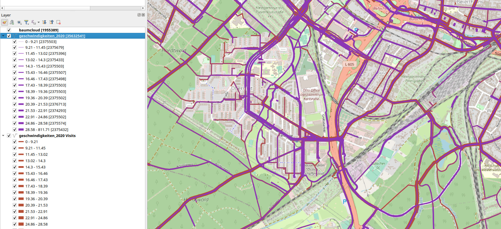

# Workshops am Open Data Day, 5.3.2022

Am OpenDataDay 2022 könnt Ihr an einem der folgenden Workshops teilnehmen:

<!--
## Datenaufbereitung und Datenvisualisierung (Variante Michael)

Im Rahmen des Open Data Day 2022 bietet das OK-Lab Karlsruhe interessierten Teilnehmern an, sich über Aufgaben zu informieren, die entstehen wenn man mit Daten aus Open Data Quellen eigene Auswertungen erstellen möchte.

Hier wird an Beispielen gezeigt, wie man in bestimmten Situationen bei der Datenbeschaffung auftretende Herausforderungen bewältigt und zu einem Ergebnis kommt, das man dann in Auswertungen verwenden kann. Die Teilnehmer können anhand der sie interessierenden Themen den Moderator anleiten, Beispiele zu suchen. Damit können Data Storys angefangen werden, die danach selbständig weiter geführt werden können.

Auch bei den Auswertungen steht der Moderator hilfreich zur Seite und zeigt, wie man die eingelesenen Daten sinnvoll darstellen und auswerten kann. Auch hier sollen die Teilnehmer die Anstöße zu den gezeigten Auswertungen und/oder Tricks geben.

 

Die Teilnehmer müssen keine Programme installieren, können das aber tun, wenn sie die Session am eigenen Beispiel nachvollziehen wollen.

In der Session werden Tools verwendet und gezeigt, die Open Source sind oder kostenfrei eingesetzt werden können.

 

### 1. Datenaufbereitung:

 * Open Data liefert oft Daten in Dateien oder Formaten, die nicht unmittelbar zur Auswertung geeignet sind.

 * Daten müssen aus den verschiedensten Quellen extrahiert und Kombiniert werden:

    + Daten aus CSV-Dateien

    + Daten aus Tabellen in PDF-Dateien

    + Daten aus API-Abrufen

 * Daten haben oft sehr verschiedene Formate:

    + CSV

    + JSON

    + Excel

    + XML

    + ...

* Daten müssen konsolidiert werden:

    + mehrere Teile der benötigten Daten aus verschiedenen Dateien zusammenführen

    + Beziehungen zwischen Dateien herstellen

    + Angaben aus mereren Quellen kombinieren

    + Säubern von Angaben

    + Ergänzen leerer Feldinhalte oder Auffüllen aus anderen Zeilen

 

### 2. Datenvisualisierung:

* eingelesene Daten in Visuals darstellen

* Verbindungen zwischen Visuals herstellen

* Filter verwenden

* ...

## Datenaufbereitung und Datenvisualisierung (Variante Martin)
Das OK Lab zeigt, wie man interaktiv Auswertungen mit offenen Daten
erstellt.
An Beispielen wird anschaulich vorgeführt, wie man von den Daten in
einem Webportal bis zu einer eigenen Visualisierung kommt.
Interaktiv können Geschichten anhand von eigenen Fragestellungen erzählt
werden.
Dazu übersetzt ein Moderator die Fragen in eine technische Umsetzung, so
dass die Fragestellungen direkt mit den Daten beantwortet und
anschaulich dargestellt werden.
Die Geschichten können eigenständig weiterentwickelt oder neue
Entdeckungstouren gestartet werden.
Bei Fragen stehen die Moderatoren mit Tipps und Tricks zur Seite.

Die genutzten Programme sind entweder Open Source oder frei verfügbar,
so dass bei Interesse die Möglichkeit besteht, diese zu installieren und
alles in der eigenen Umgebung durchzuführen.

-->

## Datenaufbereitung und Datenvisualisierung
Das OK Lab zeigt, wie man interaktiv Auswertungen mit offenen Daten
erstellt. 
An Beispielen wird anschaulich vorgeführt, wie man von den Daten in
einem Webportal bis zu einer eigenen Visualisierung kommt.
Am Anfang und Ende stehen dabei die Schritte

### Datenaufbereitung

Open Data liefert oft Daten in Dateien oder Formaten, die nicht unmittelbar zur Auswertung geeignet sind. Wir zeigen an Beispielen, wie man bei folgenden Situationen vorgehen kann:

 * Daten mit unterschiedlichen Bereitstellungsmethoden

 * Daten mit verschiedenen Formaten

 * Daten auswählen, verknüpfen und konsolidieren

und 

### Datenvisualisierung
Zur Darstellung der Ergebnisse zeigen wir Euch Grundlagen der Datenvisualisierung 

* Daten in Visuals darstellen

* Verbindungen zwischen Visuals herstellen

* Filter verwenden

Mit Euren Fragestellungen und der zugehörigen **Datenauswertung** könnt Ihr damit Eure eigenen Datenstories erstellen. Wir helfen dabei, aus Euren Fragen eine technische Umsetzung zu entwickeln.

Die genutzten Programme sind entweder Open Source oder frei verfügbar,
so dass bei Interesse die Möglichkeit besteht, diese zu installieren und
alles in der eigenen Umgebung durchzuführen.

## Datenreise durch Karlsruher Open Data
Wir wollen die Fragestellung beantworten: Welchen Wert haben offene Verwaltungsdaten für Bürgerinnen und Bürger?

Dazu zeigen wir am Beispiel von *Bauen und Wohnen* wie man durch ein OpenData-Portal navigieren kann.

Im Workshop schlüpft Ihr in verschiedene Rollen und entwickelt daraus Ideen und Fragestellungen 
zu den Verwaltungsdaten. In einem Frage-Antwort-Spiel erkunden wir dann die Datenlandschaft.
Als Ergebnis könnt Ihr eine „Kurzgeschichte“ zu dem bearbeiteten Thema mit nach Hause nehmen.

## Offene Umwelt- und Geodaten

In diesem Workshop machen wir eine Reise durch offene Umweltdaten. Wir sehen uns einige Portale von Ämtern an und zeigen, wie man anhand von Schlagworten Daten finden und in Portalen visualisieren kann.

Wir selektieren uns einige Dienste und gelangen zu einer eigenen, lokalen Kartendarstellung in einem geographischen Informationssystem (GIS), das für weitere Analysen genutzt werden kann.

Wer die Reise selbst durchführen möchte, sollte sich vorher [QGIS](https://qgis.org/de/site/) installieren (Version 3.16 mit Langzeitunterstützung), das wird das zentrale Werkzeug für die Darstellung und Kombination von Geodaten sein. Daten aus mehreren Portalen können hinzugefügt und mit lokalen Daten kombiniert werden. Wir schauen uns dafür auch die Stadtradeln Datensätze an, die etwas über die genutzten Fahrradstrecken aussagen. Entsprechend können weitere, eigene Fragestellungen untersucht werden.

Die Moderatoren stehen eigenen Erkundungen mit technischer Hilfestellung, Tipps und Tricks zur Seite.

